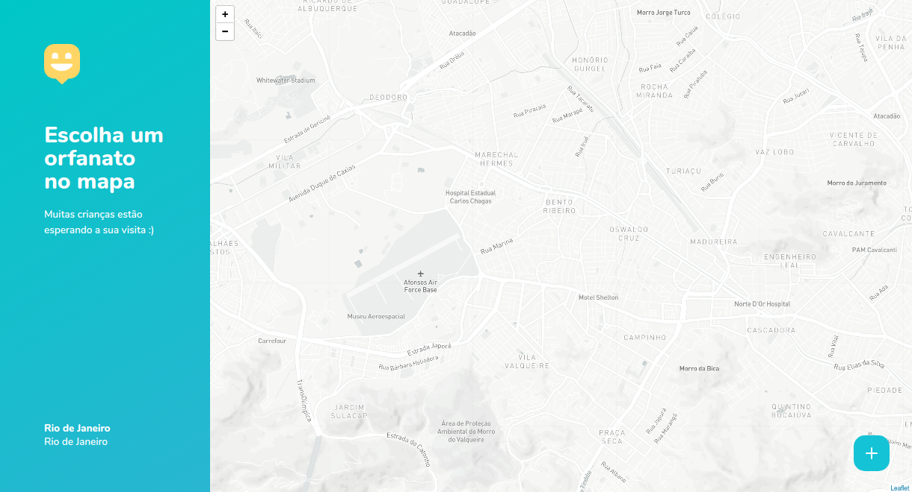

<h1 align="center" >
  
</h1>

<p align="center"> 🚀 <strong>Happy</strong>

<p align="center">Leve felicidade para o mundo, visite orfanatos e mude o dia de muitas crianças. NLW#3</p>

<h4 align="center">
 🚧  Em construção...  🚧
</h4>

<p align="center">
   
  <a href="https://github.com/jadilson12/happy#readme">
    
  </a>
  <a href="https://github.com/jadilson12/happy/graphs/commit-activity">
    
  </a>
  <a href="https://github.com/jadilson12/happy/blob/main/LICENSE">
    
  </a>
</p>

## :pushpin: Menu

- [Sobre](#sobre)
- [Layout](#layout)
- [Rotas do Backend](#rotas-do-backend)
- [Como executar](#executando-o-happy)
- [Tecnologias](#tecnologias)
- [Como contribuir](#como-contribuir)
- [Licença](#licença)

---

## 💡 Sobre

Essa aplicação permite que, se você faz parte de um orfanato, cadastre ele no mapa e caso você queira visitar um orfanato e fazer o dia de muitas crianças mais feliz, este é o lugar que vai encontrar os orfanatos mais perto de você, na cidade do Valparaiso de Goias - Goias.

Este projeto foi construído durante a terceira edição do evento Next Level Week da [Rocketseat](https://rocketseat.com.br/).

---

## 🎨 Layout

### Web

<p align="center">
  

  
</p>

---

## 🍃 Rotas do Backend

GET    - <http://localhost:3333/orphanages> --> Lista todos os orfanatos <br>
POST   - <https://localhost:3333/orphanages> --> Cadastra um novo orfanato<br>
GET    - <http://localhost:3333/orphanages/:id> --> Lista um orfanato<br>
PUT    - <http://localhost:3333/orphanages/:id> --> Atualizar um orfanato<br>
DELETE - <http://localhost:3333/orphanages/:id> --> Excluir um orfanato<br>

---

## 💻 Executando o Happy

### Pré-requisitos

É necessário ter instalado na sua máquina para execução desse projeto:

- NodeJS 12.x
- Gerenciador de pacotes (Npm ou Yarn)

> Em breve mais detalhes...

### ♊ Clonando o Repositório

```bash

$ git clone https://github.com/jadilson12/happy.git

# entre na pasta do projeto

$ cd happy

```

### 💻 Rodando o Happy web

Entre na pasta

```bash

cd web

```

Instale as dependências

```bash

$ yarn

# ou, caso use npm

$ npm install

```

Rode a aplicação

```bash

$ yarn start

# ou, caso use npm

$ npm start

```

Caso você tenha uma conta no [mapbox](https://www.mapbox.com/), pode usar seu token para utilizar o mapa da aplicação. No entanto, se você não quiser
ter este trabalho, sem problemas, por padrão já tem um mapa configurado para uso.

Caso queira, vá para a seção do <a href="#-mapbox">Mapbox</a>.

### 🌐 Rodando o Servidor

Entre na pasta

```bash

cd backend

```

Instale as dependências

```bash

$ yarn

# ou, caso use npm

$ npm install

```

Rode a aplicação

```bash

$ yarn dev

# ou, caso use npm

$ npm dev

```

### 📱 Rodando o Happy mobile

> Em breve...

<br>

[//]: <> (Se tudo deu certo, o app deve estar disponível agora! 👩🏽‍🔧)

---

## 🗺 Mapbox

Siga as instruções para usar o mapbox no lugar do openstreetmap.

- Em "https://account.mapbox.com/", copie seu token.
- Na raiz do projeto web crie um arquivo chamado ".env"
- Dentro desse arquivo, digite "REACT_APP_MAPBOX_TOKEN =" e cole seu token logo depois.
- Entre no arquivo "OrphanagesMap.tsx", descomente o trecho de código correspondente as linhas 34, 35 e 36.
- No mesmo arquivo, comente a linha 32.

Se você fez tudo corretamente, estás usando a API do mapbox com seu Token na página do mapa. 😄

---

<h2 id="tecnologias"> 🛠️ Tecnologias </h2>

As ferramentas usadas no desenvolvimento do projeto.

#### Backend

- Typescript
- NodeJS
- Express
- Express Async Errors
- TypeORM
- SQLite
- Multer
- Yup
- Cors

#### Web

- Typescript
- ReactJS ⚛️
- React Router Dom
- React Icons
- Leaflet 🍃
- API do Mapbox 🗺️

#### Mobile

> Em breve...

---

<h2 id="como-contribuir"> ⚙️ Como contribuir </h2>

- Faça um fork desse repositório;
- Crie uma branch com a sua feature: `git checkout -b minha-feature`;
- Faça commit das suas alterações: `git commit -m 'feat: Minha nova feature'`;
- Faça push para a sua branch: `git push origin minha-feature`.

---

## 📝 Licença

Jadilson Guedes <jadilson12@gmail.com>  
License MIT <https://jadilson12.mit-license.org/>
